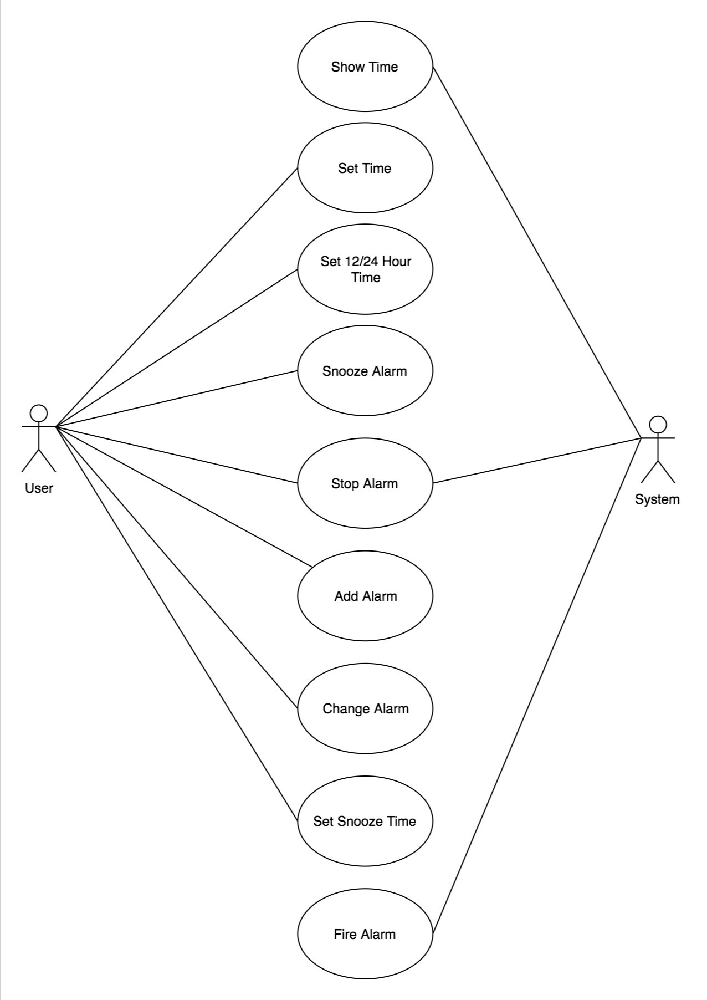

# Jacob Sokora

*We want to develop software for an alarm clock.*

*The clock shows the time of day. Using buttons, the user can set the hours and minutes fields individually, and choose between 12 and 24-hour display.*

*It is possible to set one or two alarms. When an alarm fires, it will sound some noise. The user can turn it off, or choose to “snooze”. If the user does not respond at all, the alarm will turn off itself after 2 minutes. “Snoozing” means to turn off the sound, but the alarm will fire again after some minutes of delay. This “snoozing time” is pre-adjustable.*

# Use Cases

## 1: Setting Time

User can set the time on the clock to the current time wherever they are

## Actors

The user

## Preconditions

The application is installed

## Basic Flow

The user selects the current hour and minute

## Alternate Flows

None

## Exception Flows

None

## Post Conditions

The time is set
